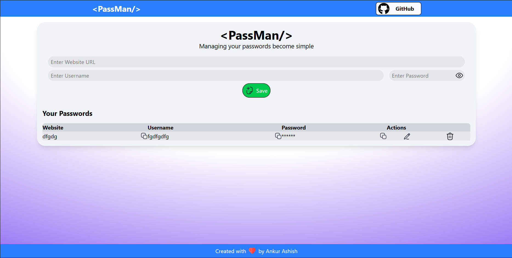

# PassMan

**PassMan** is a simple and secure password manager built with the **MERN stack**. It allows users to safely store, manage, and organize passwords for various sites and applications.

## Features

- Add, view, and delete saved passwords  
- Simple and user-friendly interface  
- Secure storage of passwords  
- Fully responsive design for desktop and mobile  

## Tech Stack

- **Frontend:** React, Vite  
- **Backend:** Node.js, Express.js  
- **Database:** MongoDB  
 

## Installation

1. **Clone the repository:**
   ```bash
   git clone https://github.com/ankurashish/passman-mongo.git
   cd passman
   ```

2. **Install dependencies:**
   ```bash
   npm install
   ```

3. **Setup environment variables:**
   Create a `.env` file in the root directory:
   ```env
   MONGO_URI=your_mongodb_connection_string
   PORT=5000
   ```

4. **Run the server:**
   ```bash
   npm run dev
   ```

5. **Open the frontend:**
   ```bash
   cd client
   npm install
   npm run dev
   ```

6. **Access the app:**  
   Open `http://localhost:5173` in your browser.

## Usage

- **Add a Password:** Fill in the site, username, and password, then click “Add.”  
- **View Passwords:** All saved passwords are displayed in a list.  
- **Delete Passwords:** Click the delete icon to remove a password from storage.  

## Screenshots

**

## Contributing

Contributions are welcome! Please open an issue or submit a pull request.  

## License

This project is licensed under the MIT License.
